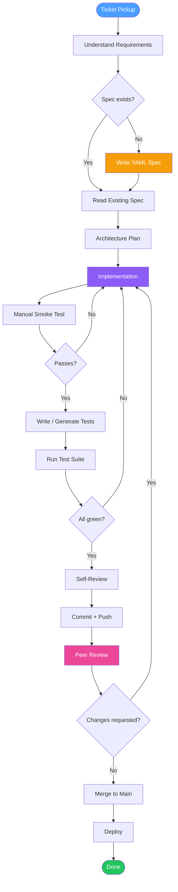

# Development Workflow Map

## Overview

This document maps the complete development workflow for the URL shortener service,
from ticket pickup through production deploy. Each step captures observed time,
tooling used, and friction points that automation targets.

---

## Workflow Flowchart

---

## Step-by-Step Breakdown

### 1. Ticket Pickup

| Attribute | Detail |
|-----------|--------|
| **Time** | 5–15 min |
| **Tools** | Issue tracker (GitHub Issues / Linear), Slack |
| **Output** | Shared understanding of acceptance criteria |

**Pain Points**
- Acceptance criteria written in prose — ambiguous edge cases (e.g., "handle duplicates" without defining idempotency semantics)
- No machine-readable contract: requirements only exist as free-form text
- Context-switching cost when tickets arrive mid-flow

---

### 2. Understand Requirements

| Attribute | Detail |
|-----------|--------|
| **Time** | 20–45 min |
| **Tools** | Spec reader, existing code (`grep`, `find`), docs |
| **Output** | Mental model of system state and constraints |

**Pain Points**
- Reading across multiple files to reconstruct intent (spec + code + tests are separate artifacts)
- No traceability links between ticket and existing REQ-IDs
- Silent assumptions about non-functional requirements (rate limits, error shapes)

---

### 3. Write / Validate Spec (`specs/url-shortener.yaml`)

| Attribute | Detail |
|-----------|--------|
| **Time** | 30–60 min (new) / 10 min (amend) |
| **Tools** | `prompts/spec-writer.yaml`, text editor, YAML linter |
| **Output** | Machine-readable spec with REQ-IDs and Gherkin scenarios |

**Pain Points**
- Spec and code can drift if spec is only updated at start of task
- No automated check that every REQ-ID in the spec has a corresponding test
- YAML schema is informal — no JSON Schema validation enforced by tooling

---

### 4. Architecture Plan

| Attribute | Detail |
|-----------|--------|
| **Time** | 15–30 min |
| **Tools** | `prompts/architect.yaml`, `docs/implementation-plan.md` |
| **Output** | File tree, interface contracts, data model decisions |

**Pain Points**
- Plan lives in a static doc that becomes stale as code evolves
- No diff between planned architecture and actual file structure
- Module boundaries not machine-checked

---

### 5. Implementation

| Attribute | Detail |
|-----------|--------|
| **Time** | 60–180 min (feature-size dependent) |
| **Tools** | Python 3.12, FastAPI, Pydantic, editor/IDE |
| **Output** | `src/*.py` changes with REQ-ID trace comments |

**Pain Points**
- No pre-commit enforcement of REQ-ID annotations in changed code
- Easy to introduce secrets/credentials in debug code
- No scope guard: edits could accidentally touch unrelated modules
- Style inconsistencies caught only at review time

---

### 6. Manual Smoke Test

| Attribute | Detail |
|-----------|--------|
| **Time** | 10–20 min |
| **Tools** | `uvicorn src.main:app --reload`, `curl`, browser |
| **Output** | Confidence that happy path works end-to-end |

**Pain Points**
- Ad-hoc: no documented smoke test checklist
- Relies on developer memory of which endpoints exist
- Results not recorded anywhere

---

### 7. Write / Generate Tests

| Attribute | Detail |
|-----------|--------|
| **Time** | 30–90 min (new scenarios) / 5 min (regression) |
| **Tools** | `prompts/test-generator.yaml`, `pytest`, `httpx` TestClient |
| **Output** | `tests/test_api.py`, `tests/test_scenarios.py` additions |

**Pain Points**
- Test generation prompt must be re-run manually after each spec change
- No enforcement that every new REQ-ID gets a test before merge
- Fixture scaffolding is copy-pasted from existing conftest

---

### 8. Run Test Suite

| Attribute | Detail |
|-----------|--------|
| **Time** | 15–30 sec (54 tests) |
| **Tools** | `pytest -q`, `pytest --tb=short` |
| **Output** | Pass/fail report |

**Pain Points**
- Coverage report not generated by default
- No enforcement that coverage stays above threshold on merge
- Test output not logged to an audit trail

---

### 9. Self-Review

| Attribute | Detail |
|-----------|--------|
| **Time** | 15–30 min |
| **Tools** | `git diff`, `prompts/code-reviewer.yaml` |
| **Output** | Annotated diff, checklist of issues to fix |

**Pain Points**
- Review prompt run manually and inconsistently
- No standard checklist format
- SSRF / injection patterns only checked if developer remembers

---

### 10. Commit + Push

| Attribute | Detail |
|-----------|--------|
| **Time** | 2–5 min |
| **Tools** | `git add`, `git commit`, `git push` |
| **Output** | Commit with message, branch pushed to remote |

**Pain Points**
- Commit messages are free-form — no conventional commits enforcement
- No automated check for secrets in staged files
- REQ-IDs not validated against spec before commit is allowed

---

### 11. Peer Review

| Attribute | Detail |
|-----------|--------|
| **Time** | 30–90 min (reviewer) / 15–60 min (author responding) |
| **Tools** | GitHub PR, inline comments |
| **Output** | Approved PR or change requests |

**Pain Points**
- Reviewer must manually cross-check spec compliance
- No shared review rubric
- PR description often omits which REQ-IDs are addressed

---

### 12. Merge to Main

| Attribute | Detail |
|-----------|--------|
| **Time** | 1–2 min |
| **Tools** | GitHub merge button, `git` |
| **Output** | Updated `main` branch |

**Pain Points**
- No automated tag or release note generation
- CHANGELOG not updated automatically
- No post-merge audit event recorded

---

### 13. Deploy

| Attribute | Detail |
|-----------|--------|
| **Time** | 5–15 min (manual) |
| **Tools** | `uvicorn` / Docker (when containerized) |
| **Output** | Running service on target environment |

**Pain Points**
- No CI/CD pipeline configured — deploy is fully manual
- No rollback procedure documented
- No deployment event logged to audit trail

---

## Aggregate Time Estimate (pre-automation baseline)

| Phase | Optimistic | Typical | Pessimistic |
|-------|-----------|---------|-------------|
| Ticket + Requirements | 25 min | 60 min | 90 min |
| Spec + Architecture | 45 min | 90 min | 120 min |
| Implementation | 60 min | 120 min | 180 min |
| Test writing | 30 min | 60 min | 90 min |
| Review + Commit | 20 min | 45 min | 90 min |
| Peer Review cycle | 30 min | 90 min | 180 min |
| Deploy | 5 min | 15 min | 30 min |
| **Total** | **~3.5 h** | **~8 h** | **~13 h** |

---

## Identified Automation Targets

| # | Pain Point | Automation Candidate |
|---|------------|---------------------|
| 1 | Spec drift vs code | `/review` command — diff spec REQ-IDs vs source |
| 2 | Missing test coverage | `/test-gen` command — generate tests from spec |
| 3 | Secret leakage in commits | `check-secrets.py` PreToolUse hook |
| 4 | Scope creep in edits | `scope-guard.sh` PreToolUse hook |
| 5 | Dangerous Bash commands | `validate-bash.py` PreToolUse hook |
| 6 | Audit trail gaps | `audit-log.sh` PostToolUse hook |
| 7 | Inconsistent commit messages | `/commit` command — conventional commits enforced |
| 8 | Manual multi-step ship | `/ship` command — test → review → commit → tag |
| 9 | New-hire ramp time | `/onboard` command — walkthrough of codebase |
