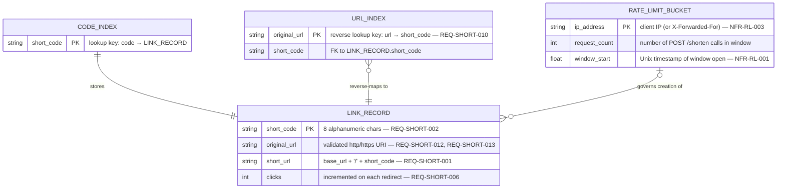
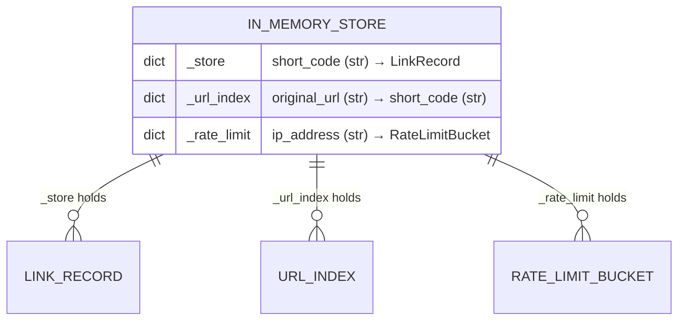

# Entity-Relationship Diagram — URL Shortener Service

> The service uses in-memory Python dicts, not a relational database.
> This diagram represents the **logical data model** — the entities, their
> fields, and the relationships between them as they exist at runtime.

---

## Core Data Model

---

## Field-Level Notes

| Entity | Field | Type | Constraint | Spec ref |
|---|---|---|---|---|
| `LINK_RECORD` | `short_code` | `str` | exactly 8 chars, `[a-zA-Z0-9]` | REQ-SHORT-002 |
| `LINK_RECORD` | `original_url` | `str` | scheme must be http/https, max 2048 chars | REQ-SHORT-012, REQ-SHORT-013, REQ-SHORT-014 |
| `LINK_RECORD` | `short_url` | `str` | derived: `{base_url}/{short_code}` | REQ-SHORT-001 |
| `LINK_RECORD` | `clicks` | `int` | ≥ 0, default 0, monotonically increasing | REQ-SHORT-006 |
| `URL_INDEX` | `original_url` | `str` | unique; enforces one code per URL | REQ-SHORT-010 |
| `RATE_LIMIT_BUCKET` | `request_count` | `int` | resets when `now - window_start ≥ 60 s` | NFR-RL-001 |
| `RATE_LIMIT_BUCKET` | `window_start` | `float` | Unix epoch seconds | NFR-RL-001 |

---

## Runtime Storage Layout

### Key design decisions

- **Two parallel indexes** (`_store` + `_url_index`) give O(1) lookup in both
  directions: code→URL for redirect (REQ-SHORT-004) and URL→code for idempotent
  shorten (REQ-SHORT-010).
- **No shared mutable state between `LINK_RECORD` and `RATE_LIMIT_BUCKET`** —
  rate limiting is enforced before any store operation, so a rejected request
  never touches the link store.
- **No TTL or expiry fields** — not required by the current spec. A future
  `expires_at` column on `LINK_RECORD` would enable link expiry.
