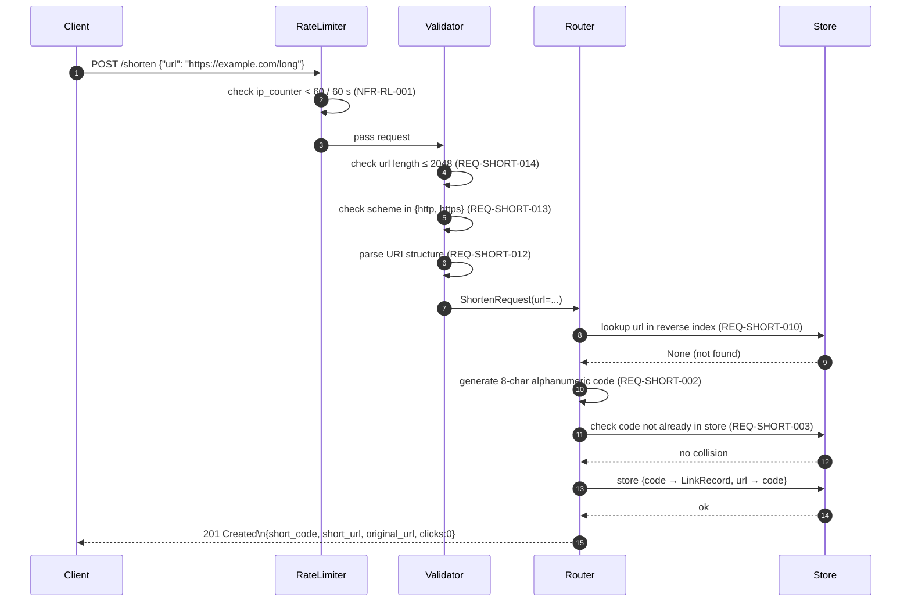
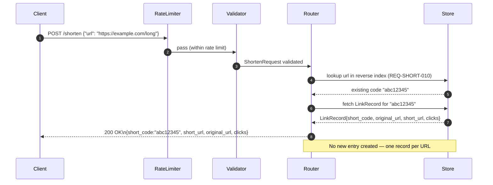
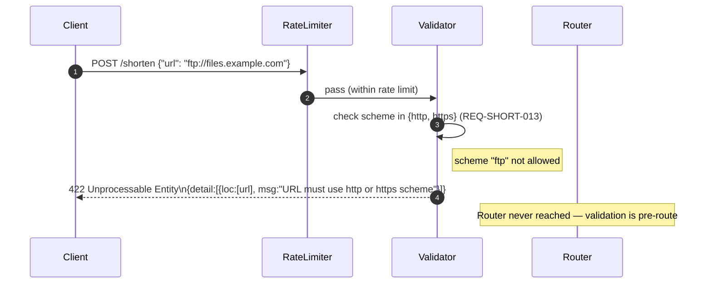
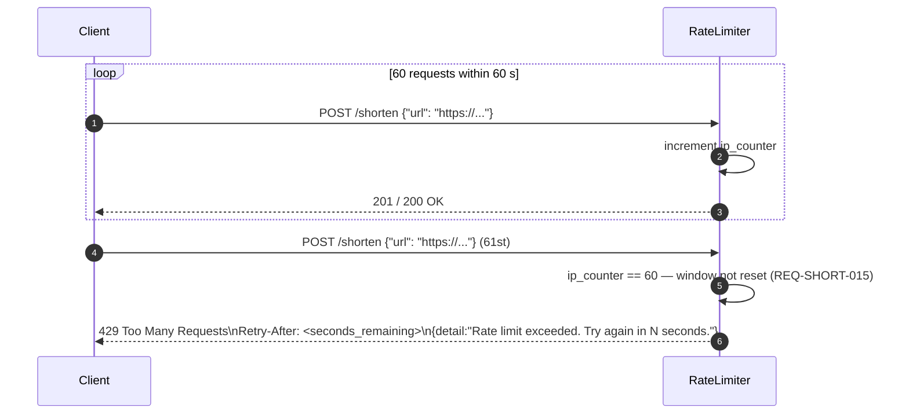
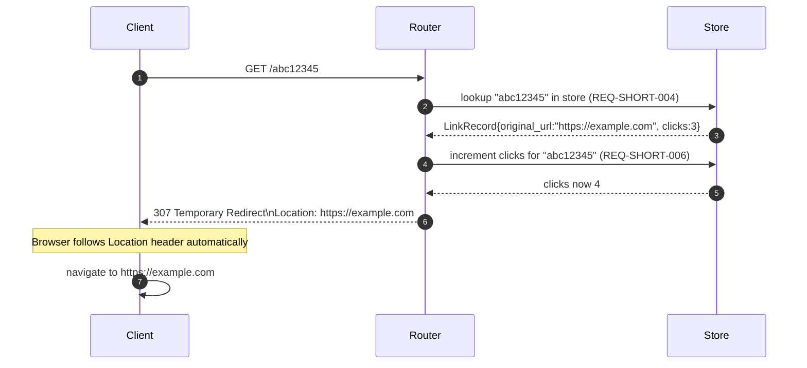
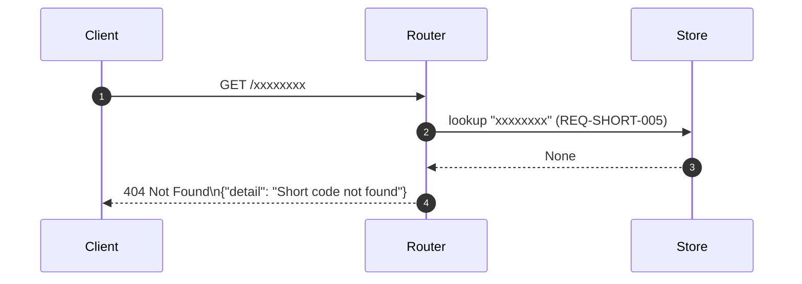
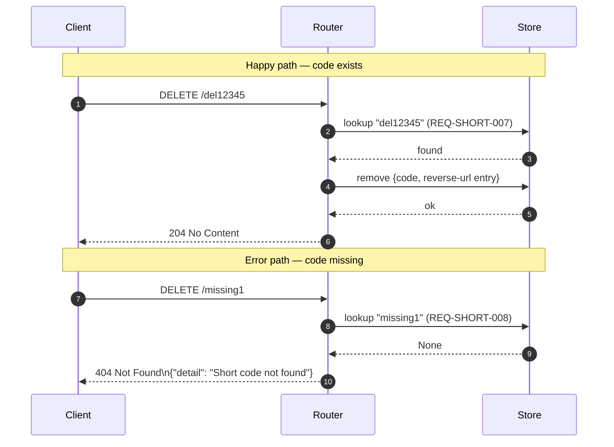
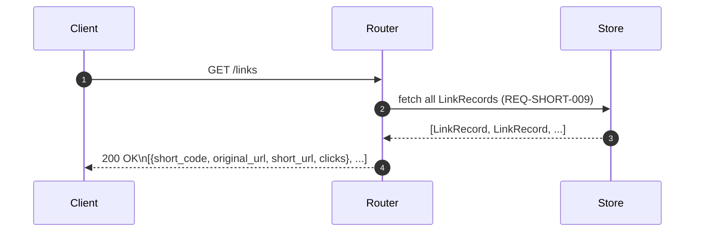
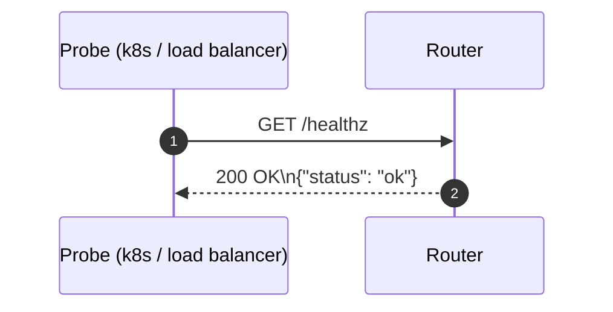

# Sequence Diagrams — URL Shortener Service

Participants used throughout:
- **Client** — API consumer (curl, app) or browser
- **RateLimiter** — in-process sliding-window middleware (NFR-RL-001)
- **Validator** — Pydantic model layer (NFR-VAL-001, NFR-VAL-002, NFR-VAL-003)
- **Router** — FastAPI route handlers
- **Store** — in-memory dict + reverse URL index

---

## 1. POST /shorten — New URL (REQ-SHORT-001, REQ-SHORT-002, REQ-SHORT-003)

---

## 2. POST /shorten — Duplicate URL / Idempotent (REQ-SHORT-010)

---

## 3. POST /shorten — Validation Failure (REQ-SHORT-012, REQ-SHORT-013, REQ-SHORT-014)

---

## 4. POST /shorten — Rate Limit Exceeded (REQ-SHORT-015, NFR-RL-001, NFR-RL-002)

---

## 5. GET /{code} — Successful Redirect (REQ-SHORT-004, REQ-SHORT-006)

---

## 6. GET /{code} — Code Not Found (REQ-SHORT-005)

---

## 7. DELETE /{code} — Happy and Error Paths (REQ-SHORT-007, REQ-SHORT-008)

---

## 8. GET /links — List All Mappings (REQ-SHORT-009)

---

## 9. GET /healthz — Liveness Probe (REQ-SHORT-011)

