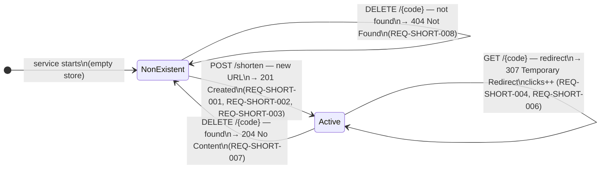
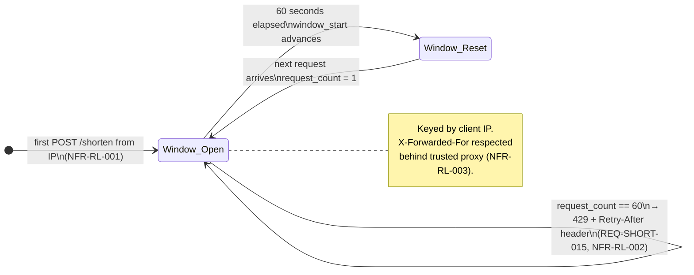

# State Diagram — Short URL Lifecycle

---

## Top-Level Lifecycle



---

## Active State — Click-Count Sub-States

```mermaid
stateDiagram-v2
    direction LR

    state Active {
        [*]      --> Clicks_0
        Clicks_0 --> Clicks_1 : GET /{code} (1st redirect)\nclicks = 1
        Clicks_1 --> Clicks_N : GET /{code} (2nd redirect)\nclicks = 2
        Clicks_N --> Clicks_N : GET /{code} (Nth redirect)\nclicks++

        state Clicks_0 { [*]: clicks == 0 }
        state Clicks_1 { [*]: clicks == 1 }
        state Clicks_N { [*]: clicks >= 2 }
    }

    note right of Active
        clicks is monotonically increasing.
        It is never decremented and resets
        only if the link is deleted and
        re-created (REQ-SHORT-006).
    end note
```

---

## Rate Limiter State (per IP address)



---

## State Transition Table

| From state | Event | Guard | To state | HTTP response |
|---|---|---|---|---|
| `NonExistent` | `POST /shorten` | valid URL, under rate limit, URL is new | `Active` | 201 Created |
| `Active` | `POST /shorten` | valid URL, under rate limit, URL already mapped | `Active` (unchanged) | 200 OK |
| `NonExistent` or `Active` | `POST /shorten` | invalid URL (bad scheme / syntax / length) | unchanged | 422 Unprocessable Entity |
| `NonExistent` or `Active` | `POST /shorten` | rate limit exceeded for this IP | unchanged | 429 Too Many Requests |
| `Active` | `GET /{code}` | code exists | `Active` (clicks++) | 307 Temporary Redirect |
| `NonExistent` | `GET /{code}` | code not in store | `NonExistent` | 404 Not Found |
| `Active` | `DELETE /{code}` | code exists | `NonExistent` | 204 No Content |
| `NonExistent` | `DELETE /{code}` | code not in store | `NonExistent` | 404 Not Found |
| any | `GET /links` | — | unchanged | 200 OK |
| any | `GET /healthz` | — | unchanged | 200 OK |
